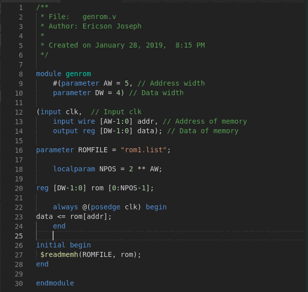

# vscode VerilogFormat 

VerilogFormat Extension is a tool for formatter verilog files. This extension use the console aplication verilog-format.

## Features



## Requirements

1. verilog-format executable.  
 
   [Install verilog-format](https://github.com/ericsonj/verilog-format)

## Extension Settings

1. File > Preferences > Settings > Verilog Format > Path

    Path of executable verilof-format.
    
    * LINUX: `<PATH>/verilog-format`
    * WIN:   `<PATH>/verilog-format.exe`

2. File > Preferences > Settings > Verilog Format > Settings

    Path of file `.verilog-format.properties` (global settings). Example:  `~/.verilog-format.properties`  
    
    ```properties
    IndentWidth=4
    IndentType=tab
    ```

    **Important**: If project folder don't have the file `.verilog-format.properties` (local settings) the global settings is used. If no files exist the internal settings is used.

## Known Issues

ERR: multiple module align in file not work.

## Release Notes

Line indent and align module definition.

### 1.0.0

Initial release of verilog-format vscode extension.