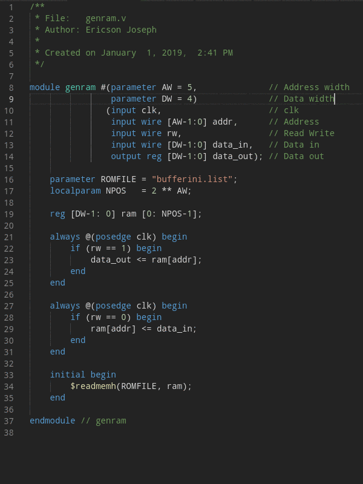

# vscode VerilogFormat 

VerilogFormat Extension is a tool for formatter verilog files. This extension use the console aplication verilog-format.



## Requirements

1. IMPORTANTE, verilog-format executable.  
 
   [Install verilog-format](https://github.com/ericsonj/verilog-format)

## Extension Settings

1. File > Preferences > Settings > Verilog Format > Path

    Path of executable verilof-format.
    
    * LINUX: `<PATH>/verilog-format`
    * WIN:   `<PATH>/verilog-format.exe`

2. File > Preferences > Settings > Verilog Format > Settings

    Path of file `.verilog-format.properties` (global settings). Example:  `~/.verilog-format.properties`  
    
    ```properties
    IndentWidth=4
    IndentType=tab
    ```

    **Important**: If project folder don't have the file `.verilog-format.properties` (local settings) the global settings is used. If no files exist the internal settings is used.


## Verilog-Format Style Options

This options are setting in `.verilog-format.properties` file.

### Example

```properties
## File .verilog-format.properties
IndentWidth=4
IndentType=space
SpacesBeforeTrailingComments=0
SpacesAfterTrailingComments=0
AlignLineComments=true
AlignNoBlockingAssignments=true
AlignBlockingAssignments=true
SpacesInParentheses=false
SpacesInSquareBrackets=false
```

---
### IndentWidth=[number]

```verilog
// IndentWidth=4  #(default)
always @(posedge clk)
    if (load == 1)
        bitc <= 0;
    else if (load == 0 && clk_baud == 1)
        bitc <= bitc + 1;

// IndentWidth=1
always @(posedge clk)
 if (load == 1)
  bitc <= 0;
 else if (load == 0 && clk_baud == 1)
  bitc <= bitc + 1;
```
--- 
### IndentType=[space|tab]
```verilog
// IndentType=space  #(default)
always @(posedge clk)
    if (load == 1)
        bitc <= 0;
    else if (load == 0 && clk_baud == 1)
        bitc <= bitc + 1;

// IndentType=tab  #  not recommended yet
always @(posedge clk)
<tab>if (load == 1)
<tab><tab>bitc <= 0;
<tab>else if (load == 0 && clk_baud == 1)
<tab><tab>bitc <= bitc + 1;
```
---
### SpacesInParentheses=[true|false]
```verilog
// SpacesInParentheses=false  #(default)
always @(posedge clk)
    if (load == 1)

// SpacesInParentheses=true
always @( posedge clk )
    if ( load == 1 )
```
---

### SpacesInSquareBrackets=[true|false]
```verilog
// SpacesInSquareBrackets=false  #(default)
reg [DW-1:0] rom [0:NPOS-1];

always @(posedge clk) begin
    data <= rom[addr];
end

// SpacesInSquareBrackets=true
reg [ DW-1:0 ] rom [ 0:NPOS-1 ];
    
always @(posedge clk) begin
    data <= rom[ addr ];
```
---
### AlignBlockingAssignments=[true|false]
```verilog
// AlignBlockingAssignments=true  #(default)
assign load    = (state == START) ? 1 : 0;
assign baud_en = (state == IDLE) ? 0 : 1;

// AlignBlockingAssignments=false
assign load = (state == START) ? 1 : 0;
assign baud_en = (state == IDLE) ? 0 : 1;

```
---
### AlignNoBlockingAssignments=[true|false]
```verilog
// AlignNoBlockingAssignments=true  #(default)
state_ts   <= IDLE;
state_pad  <= IDLE;
state_wait <= IDLE;

// AlignNoBlockingAssignments=false
state_ts <= IDLE;
state_pad <= IDLE;
state_wait <= IDLE;
```
---
### AlignLineComments=[true|false]
```verilog
// AlignLineComments=false  #(default)
always @(posedge clk) // always
    if (load == 1)  // if
        bitc <= 0; //
    else if (load == 0 && clk_baud == 1) // else if
        bitc <= bitc + 1; //

// AlignLineComments=true
always @(posedge clk)                    // always
    if (load == 1)                       // if
        bitc <= 0;                       //
    else if (load == 0 && clk_baud == 1) // else if
        bitc <= bitc + 1;                //
```
---
### SpacesBeforeTrailingComments=[number]
```verilog
// SpacesBeforeTrailingComments=1  #(default)
localparam IDLE  = 0; //IDLE

// SpacesBeforeTrailingComments=0
localparam IDLE  = 0;//IDLE
```
---
### SpacesAfterTrailingComments=[number]
```verilog
// SpacesAfterTrailingComments=0  #(default)
localparam IDLE  = 0; //IDLE

// SpacesAfterTrailingComments=3
localparam IDLE  = 0; //   IDLE
```
---

## Known Issues

ERR: multiple module align in file not work.

## Release Notes

Line indent and align module definition.

SpacesBeforeTrailingComments
SpacesAfterTrailingComments
AlignLineComments
AlignNoBlockingAssignments
AlignBlockingAssignments
SpacesInParentheses
SpacesInSquareBrackets

### 1.0.1

Add more documentation, new feactures and fix bugs.

### 1.0.0

Initial release of verilog-format vscode extension.